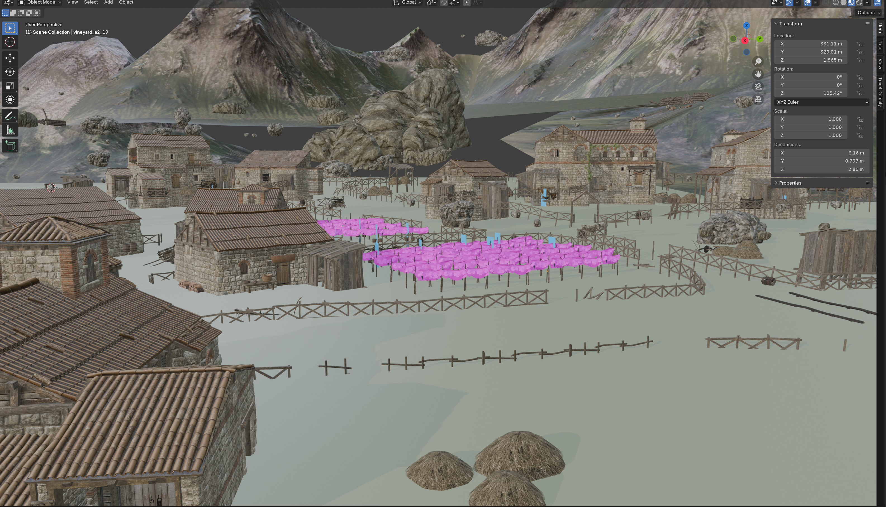
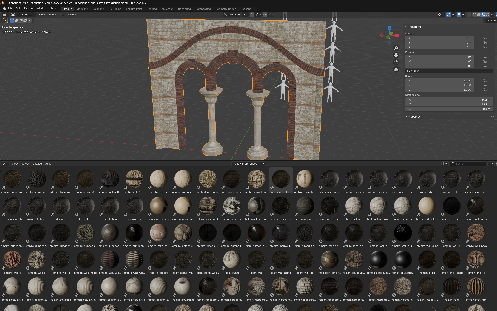

# Bannerlord Reference (Blender)

Blender 4.4 reference files rebuilt from Mount & Blade II: Bannerlord's own scene and prefab data, for modders who want to
study, measure or block out Bannerlord-style architecture and scenes in Blender.





## Download

The files are large (about 15 GB with full-resolution textures), so they are hosted on the Internet Archive, not in this repository:

**https://archive.org/details/bannerlord-reference-blender**

**Status (2026-09-19): the archive upload is being redone.** The first attempt failed part-way, and the package has since gained the
physics-material library. Until `Bannerlord-Reference-Distribution.7z` is listed on that page, only the small files are there. When it
is: download it, extract with [7-Zip](https://www.7-zip.org/) (free), and open the `.blend` files.

This repository holds the documentation, the licence, the relocation script and the one file small enough to live here:
`Bannerlord-Physics-Materials.blend` (160 KB, no textures; see "Physics materials" below). Everything else is in the archive.

Everything here is derived from TaleWorlds' game assets (Native and the Naval DLC). See LICENSE.md for what that means.

## What's in the folder

| File | Contents |
|---|---|
| `Bannerlord-Reference-Buildings.blend` | 1,600+ Native and Naval DLC building prefabs, one collection per culture (Empire, Vlandia, Aserai, Khuzait, Sturgia, Nord, Battania, Shared), sub-divided into Walls, Towers & Gates, Keeps, Houses, Farm & Utility, Misc, Modular, DLC. Every prefab keeps its in-game entity hierarchy (Empty per entity, meshes underneath). |
| `Bannerlord-Prop-Production-Buildings.blend` | The same set on a plain working scene. |
| `Bannerlord-Scene-empire_village_a.blend` | The Native village scene `empire_village_a` rebuilt entity by entity, with its terrain heightmap and paint layers. |
| `Bannerlord-Mesh-Library.blend` | Every mesh the files above use, one prototype object each, sorted into `Lib_<Culture>` collections. The other files append from it. |
| `Bannerlord-Physics-Materials.blend` | The 41 physics materials from the game's `physics_materials.xml` (`stone`, `wood`, `wood_nonstick`, `adobe`, `metal`, ...) as Blender asset materials, colour-coded with the engine's own display colours, with friction / arrows-stick / flammable notes in the description. No textures. See "Physics materials" below. |
| `blender_assets.cats.txt` | Asset catalog file for the line above. Only needed if you register this folder as an asset library. |
| `deps\textures\...` | Only the textures the blends reference, at native resolution, in the same folder layout as the material library they came from. |
| `tools\` | `Relocate-BannerlordReference.ps1` (+ `bl_relocate.py`): copies or moves this folder somewhere else and keeps every texture path valid. `texconv.exe` is only used by its optional downscale switch. |

## Installing / moving the folder

You need Blender 4.4 (or newer 4.x) installed. Nothing else.

**Simplest:** unzip the whole folder anywhere and open the `.blend` files. All texture paths are relative, so the folder
works from any location as long as you keep it together (the blends, `deps\` and `tools\` side by side).

**With the script** (when you want it in a specific place, or want smaller textures):

1. Open PowerShell in this folder (Shift + right-click the folder background > "Open PowerShell window here", or type
   `powershell` in the folder's address bar).
2. Run one of:

   ```powershell
   # copy to Documents\Bannerlord-Reference (the default)
   .\tools\Relocate-BannerlordReference.ps1

   # copy to a folder of your choice
   .\tools\Relocate-BannerlordReference.ps1 -Destination "D:\Blender\Bannerlord-Reference"

   # same, but with every texture downscaled to 2048 px (much lighter in the viewport, about a quarter of the size)
   .\tools\Relocate-BannerlordReference.ps1 -Destination "D:\Blender\Bannerlord-Reference" -MaxTexture 2048

   # move instead of copy (the source is deleted only if everything copied and remapped cleanly)
   .\tools\Relocate-BannerlordReference.ps1 -Destination "D:\Blender\Bannerlord-Reference" -Move
   ```

3. Wait for the `done ->` line. The script finds Blender itself; if it can't, pass `-Blender "C:\path\to\blender.exe"`.

If Windows refuses to run the script ("running scripts is disabled on this system"), start it as
`powershell -ExecutionPolicy Bypass -File .\tools\Relocate-BannerlordReference.ps1 ...` instead; nothing else changes.

What it does: copies the folder, asks Blender which files each `.blend` references, copies those into `deps\`, then rewrites the
paths inside the copied blends so they point at the copies. It never modifies the folder it copies from (unless you pass `-Move`).
A full-resolution copy is about 17 GB and takes a minute or two on an SSD.

## Using the files

* Collections are **disabled** (unticked in the outliner) by default so a file opens fast. Tick a culture or category on to see it.
* Every prefab is an Empty named after the prefab; its parts are parented underneath. Move the Empty, not the parts.
* Objects carry custom properties: `bl_mesh` (engine mesh name), `bl_prefab` (prefab the entity instanced), `bl_bend_amount` /
  `bl_bend_center` on entities that use the engine's mesh bender (they also get a SimpleDeform modifier as an approximation).
* Objects named `BEND~...` carry the mesh bender; objects tagged `bl_sheared` have a sheared engine transform baked into a mesh copy.
* Materials use the engine material names, so an FBX export links back to the game's materials in the Modding Kit editor.
* Material Preview on a whole culture at once loads a lot of 4k/8k textures. Enable one category at a time, or set
  Preferences > Viewport > Textures > Limit Size to 2048.

## Physics materials

Bannerlord picks the physics material of a collision mesh (`bo_<name>`) from the **name of the material** on it: a face with a
material called `stone` becomes stone, `wood_nonstick` becomes wood that arrows don't stick to, and any name the engine does not
know silently falls back to `default`. So the trick is just to spell the names right.

`Bannerlord-Physics-Materials.blend` gives you every valid name as a drag-and-drop asset:

1. Preferences > File Paths > Asset Libraries > `+`, pick this folder (or open the blend and append the materials you need).
2. In the Asset Browser choose *Bannerlord Native > Physics Materials*.
3. Select the `bo_` object, Edit Mode, select the faces of one part, drag the material onto the mesh. Use *Append (Reuse Data)*
   so a second use does not create `stone.001` (the `.001` would break the match).
4. Repeat per part and export. In the Modding Kit, switch on the physics display to check: each part shows the material's colour,
   the same colours these assets use in Solid view. Anything in the `default` colour has a name the engine did not recognise.

The materials are plain flat colours, only their names matter. Weapon / shield / missile entries (`metal_weapon`, `wood_shield`,
`missile`, ...) are for items, not scene props.

## Known gaps

* A handful of engine materials have no exportable textures and show as flat colour: editor helpers, one water shader, `vineyard_a_animated`.
* Flora painted on terrain (grass, bushes placed by the terrain paint system) is not reproduced.
* The mesh-bender deformation is an approximation (axis and magnitude tuned by eye).

## Licence and credits

Three parts, three owners; see `LICENSE.md` for the full text:

* **Game assets** (every mesh, texture, material and scene layout): © TaleWorlds Entertainment, from Mount & Blade II:
  Bannerlord and the War Sails DLC. No ownership is claimed here. Use is governed by TaleWorlds' mod terms
  (<https://www.taleworlds.com/en/static/mtla>): non-commercial modding of the game only.
* **The reference layout, reconstruction and this documentation**: CC BY-NC-SA 4.0
  (<https://creativecommons.org/licenses/by-nc-sa/4.0/>). Credit the maintainer, no commercial use, share alike.
* **The scripts in `tools\`**: MIT. `texconv.exe` is Microsoft DirectXTex, MIT, see `THIRD-PARTY-NOTICES.md`.

Maintainer: FiefEvictionNotice.
